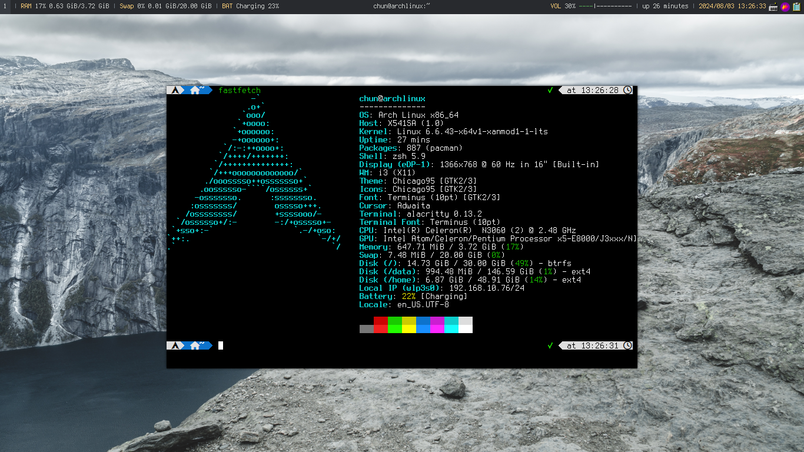
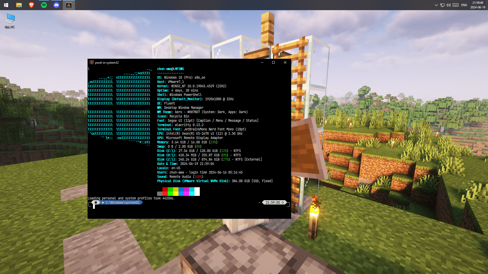

# dotfiles
## Installation (for zsh & tmux config)
```console
$ git clone --depth 1 https://github.com/chun-awa/dotfiles
$ cd dotfiles
$ ./setup.sh
```
## Screenshots
i3


Windows 10 with fastfetch and alacritty running

