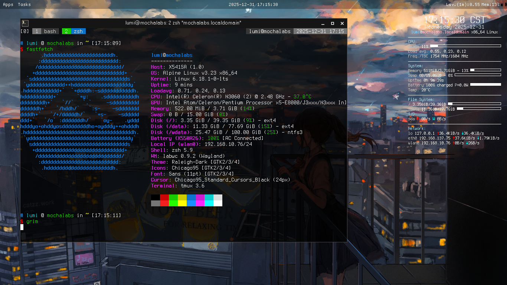

# dotfiles

## Installation (for zsh & tmux config)

```console
$ git clone --depth 1 https://github.com/chun-awa/dotfiles
$ cd dotfiles
$ ./setup.sh # For normal setups
$ ./setup.sh --xfce4 # Also copys xfce4 configuration
```

## Screenshots

> [!NOTE]
> All screenshots are not exactly using the corresponding configurations at that commit.

labwc (at commit `a0c4e3a`)


i3 (at commit `2a77b03`)


Windows 10 with fastfetch running in alacritty (at commit `03c4609`)

